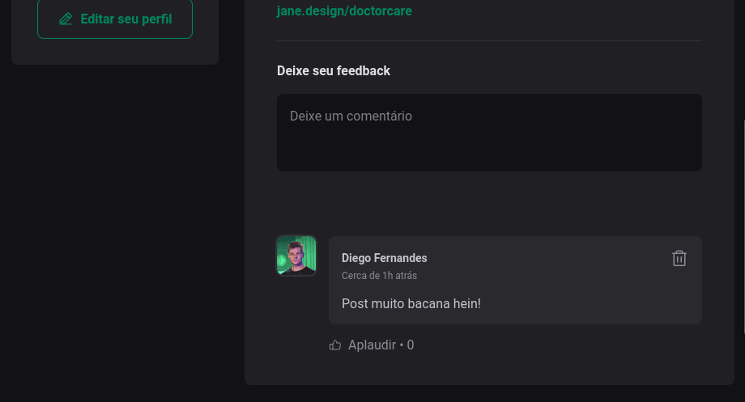
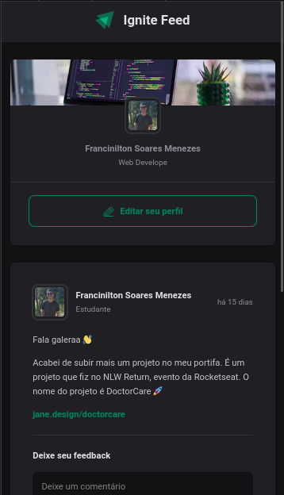
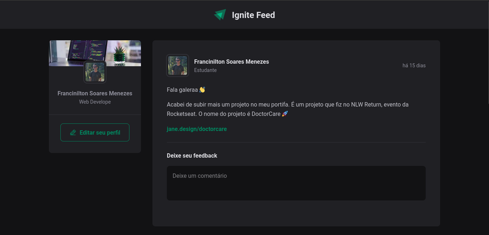

<p align="center" >

</p>
<h1 align="center">
    Ignite Feed
</h1>


<h2 align="center"> Aplicação Rocketseat Ignite Feed 💻 🚀 </h2>


<h2>📷 Preview </h2>
<h1 align="center">
  <div style="display: flex; flex-direction: row;">
    
  <div>
</h1>

<h1 align="center">
  <div style="display: flex; flex-direction: row;">
    
    
  <div>
</h1>

Ignite feed é um projeto que simula o feed das redes sociais, com funcionalidades como comentários, aplaudir e apagar comentário. 

<h2 id="technologies"> 🛠 Tecnologias utilizadas: </h2>

- [ReactJS](https://reactjs.org)
- [NodeJS](https://nodejs.org/en/)
- [Yarn](https://yarnpkg.com) or Npm
- [Git Bash](https://gitforwindows.org/)
- [Phosphor Icons](https://www.google.com/url?sa=t&rct=j&q=&esrc=s&source=web&cd=&cad=rja&uact=8&ved=2ahUKEwjFm-TeifD7AhWyr5UCHVSZA1wQFnoECBAQAQ&url=https%3A%2F%2Fphosphoricons.com%2F&usg=AOvVaw0B6_0g-qmH9oxUW4xxfnJG)


```bash
# Clone Repository
$ git clone https://github.com/franciniltonsoaresmenzes/ignite-feed.git

# Go to server folder
$ cd https://github.com/franciniltonsoaresmenzes/ignite-feed.git

# Install Dependencies

$ npm install

$ npm run dev

# Access localhost
http://localhost:3000
```

<p align="center">
  Feito com 💜 by <a href="https://www.rocketseat.com.br/" >Rocketseat</a>
</p>
